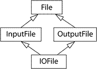

# 继承与面向对象设计

## Item 32：确定你的public继承塑模出is a关系

C++ 面向对象程序设计中，最重要的规则便是：public 继承应当是"is-a"的关系。当 Derived public 继承自 Base时， 相当于你告诉编译器和所有看到你代码的人：Base 是 Derived 的抽象，Derived 就是一个 Base，任何时候Derived 都可以代替 Base使用。

比如一个 Student 继承自 Person，那么 Person 有什么属性 Student  也应该有，接受 Person  类型参数的函数也应当接受一个 Student：

```
void eat(const Person& p);
void study(const Person& p);
 
Person p; Student s;
eat(p); eat(s);
study(p); study(s);
```

上述例子也好理解，也很符合直觉。但有时情况却会不同，比如 Penguin 继承自 Bird，但企鹅不会飞：

```
class Bird{
public:
    vitural void fly();
};
class Penguin: public Bird{
    // fly??
};
```

这时你可能会困惑  Penguin 到底是否应该有 fly() 方法。但其实这个问题来源于自然语言的二义性： 严格地考虑，鸟会飞并不是所有鸟都会飞。我们对会飞的鸟单独建模便是：

```
class Bird{...};
class FlyingBird: public Bird{
public:
    virtual void fly();
};
class Penguin: public Bird{...};
```

这样当你调用 penguin.fly()  时便会编译错。当然另一种办法是  Penguin  继承自拥有 fly()  方法的 Bird， 但 Penguin::fly() 中抛出异常。这两种方式在概念是有区别的：前者是说企鹅不能飞；后者是说企鹅可以飞，但飞了会出错。

哪种实现方式好呢？接口应当设计得不容易被误用，最好将错误从运行时提前到编译时。所以前者更好！

生活的经验给了我们关于对象继承的直觉，然而并不一定正确。比如我们来实现一个正方形继承自矩形：

```
class Rect{...};
void makeBigger(Rect& r){
    int oldHeight = r.height();
    r.setWidth(r.width()+10);
    assert(r.height() == oldHeight);
}
class Square: public Rect{...};
 
Square s;
assert(s.width() == s.height());
makeBigger(s);
assert(s.width() == s.height());
```

根据正方形的定义，宽高相等是任何时候都需要成立的。然而 makeBigger 却破坏了正方形的属性， 所以正方形并不是一个矩形（因为矩形需要有这样一个性质：增加宽度时高度不会变）。即 Square 继承自 Rect 是错误的做法。 C++ 类的继承比现实世界中的继承关系更加严格：任何适用于父类的性质都要适用于子类！

# 总结

- public 继承意味着 "is-a"。适用于 base classes 的每一件事也适用于 derived classes，因为每一个 derived class 对象都是一个 base class 对象。


## Item 33：避免遮掩继承而来的名称

隐藏名称是作用域的问题。 在 C++ 中每一对`{}`都会开启一个新的作用域，并嵌套在当前作用域中。

```
int x;
void func(){
    double x;
    cin>>x;  //@ double x  隐藏了 int x
}
```

子类可以访问父类中的名称，是因为子类的作用域是嵌套在父类的作用域中的。 

```
class Base{
public:
    void func_base();
};
class Derived{
public:
    void func_derived(){
        func_base();
    }
};
```

在 func_derived() 中调用 func_base() 时：

- 编译器首先检查当前作用域内是否有名称 func_base（当然C++是不允许在函数里定义函数的）
-  如果没有找到，然后去父作用域 Derived 中寻找名称 func_base
- 如果仍然未找到，然后去再上一级作用域 Base  中寻找 func_base，找到了！然后调用 Base::func_base()。
- 如果还没找到，编译器还会去 Derived 所在命名空间下、全局作用域下寻找。

子类中重写（override）与父类方法同名的方法，将会隐藏父类中所有同名的重载方法。

```
class Base{
public:
    virtual void func()=0;
    void func(int);
};
class Derived: public Base{
public:
    virtual void func();
};
...
Derived d;
d.func(1);      //@ 错误，Derived 中声明的 func 方法，隐藏了父类中所有的 func 名称
```

当你从父类继承来了一系列的重载方法，而只想重写其中的一个时，可以用 using，否则其他重载方法会被隐藏。

```
class Derived: public Base{
public:
    using Base::func;
    virtual void func();
};
...
d.func(1);      // OK
```

在 public 继承中，子类和父类是 "is-a" 的关系，所以通常我们希望从父类继承所有的方法。 但如果是 private 继承， 可能你只想要其中的一个，这时可以定义一个转调函数：

```
public:
	virtual void mf1() = 0;
	virtual void mf1(int);
};

class Derived : private Base {
public:
	virtual void mf1() {     //@ 转调函数
		Base::mf1(1);        //@ 这是一个inline函数
	}
};

Derived d;
int x;
d.mf1();		//@ 调用 Derived::mf1
d.mf1(x);		//@ 错误，Base::mf1 被遮掩了
```

### 总结

- derived classes 中的名字覆盖 base classes 中的名字，在 public 继承中，这从来不是想要的。
- 为了使隐藏的名字重新可见，使用 using 声明或者转调函数。


## Item 34：区分接口继承和实现继承

 当你 public 继承一个类时，接口是一定会被继承的，你可以选择子类是否应当继承实现：

- 不继承实现，只继承方法接口：纯虚函数。
- 继承方法接口，以及默认的实现：虚函数。
- 继承方法接口，以及强制的实现：普通函数。

Rect  和 Ellipse 都继承自 Shape。

```
class Shape{
public:
    //@ 纯虚函数
    virtual void draw() const = 0;
    //@ 非纯虚函数
    virtual void error(const string& msg);
    //@ 普通函数
    int id() const;
};
class Rect: public Shape{...};
class Ellipse: public Shape{...};
```

public 继承，基类的成员函数接口总是会传递到子类。

- draw() 是一个纯虚函数，子类必须重新声明 draw 方法，同时父类不给任何实现。
- error() 是一个普通的虚函数，子类可以提供一个 error 方法，也可以使用默认的实现。
- id() 是一个普通函数，子类继承了这个接口，以及强制的实现方式。

因为像 ID 这种属性子类没必要去更改它，直接在父类中要求强制实现！

默认实现通常是子类中共同逻辑的抽象，显式地规约了子类的共同特性，避免了代码重复，方便了以后的增强，也便于长期的代码维护。

然而有时候提供默认实现是危险的，因为你不可预知会有怎样的子类添加进来。例如一个 Airplane 类以及它的几个 Model 子类：

```
class Airplane{
public:
    virtual void fly(){
    }
};
class ModelA: public Airplane{...};
class ModelB: public Airplane{...};
```

不难想象，我们写父类 Airplane 时，其中的 fly 是针对 ModelA 和 ModelB 实现了通用的逻辑。如果有一天我们加入了 ModelC 却忘记了重写 fly方法：

```cpp
class ModelC: public Airplane{...};
Airplane* p = new ModelC;
p->fly();
```

虽然 ModelC 忘记了重写 fly 方法，但代码仍然成功编译了！这可能会引发灾难。

这个设计问题的本质是普通虚函数提供了默认实现，而不管子类是否显式地声明它需要默认实现。

我们可以用另一个方法来给出默认实现，而把 fly 声明为纯虚函数，这样既能要求子类显式地重新声明一个 fly，当子类要求时又能提供默认的实现。

```
class Airplane{
public:
    virtual void fly() = 0;
protected:
    void defaultFly(){...}
}
class ModelA: public Airplane{
public:
    virtual void fly(){ defaultFly();}
}
class ModelB: public Airplane{
public:
    virtual void fly(){ defaultFly();}
}
```

这样当我们再写一个 ModelC 时，如果自己忘记了声明 fly() 会编译错，因为父类中的 fly() 是纯虚函数。 如果希望使用默认实现时可以直接调用 defaultFly()。

上面我们给出了一种方法来提供安全的默认实现。有人认为这些名字难以区分的函数污染了命名空间。

我们可以为纯虚函数提供实现，编译会通过。但只能通过 Airplane::fly 的方式调用它。

```
class Airplane{
public:
    virtual void fly() = 0;
};
void Airplane::fly(){
}
 
class ModelA: public Airplane{
public:
    virtual void fly(){
        Airplane::fly();
    }
};
```

上述的实现和普通成员函数 defaultFly 并无太大区别，只是把 defaultFly 和 fly 合并了。 合并之后其实是有一定的副作用的：原来的默认实现是 protected，现在变成 public 了。在外部可以访问它：

```
Airplane* p = new ModelA;
p->Airplane::fly();
```

### 总结

- 接口继承与实现继承不同。在 public 继承下，派生类总是继承基类接口：
  - 纯虚函数指定仅有接口被继承。
  - 普通虚函数接口继承加上缺省实现继承。
  - 普通函数指定接口继承加上强制实现继承。
- 可以为纯虚函数提供实现，调用函数时需要使用类名作用域符。


## Item 35：考虑virtual函数以外的其他选择

### 替代虚函数实现的方案概述

假如现在正在写一个游戏，游戏中人物的血量随着战斗而减少，用一个函数 healthValue 返回这个血量值。因为不同人物血量值计算方法不同，所以应该讲 healthValue 声明为 virtual：

```
class GameCharacter{
public:
    virtual int healthValue() const;	//@ 派生类可以重新定义
    //@ ……
};
```

这样的实现使得我们不会考虑其他的方法，但是其实有很多的替代方案：

- 藉由 Non-virtual Interface 手法实现 Template Method 模式，用非虚函数来调用更加封装的虚函数。
- 藉由 Function Pointers 实现 Strategy 模式。
- 藉由 std::function 完成 Strategy 模式。
- 古典的 Strategy 模式。

### NVI 实现模板方法模式

先看一个主张：virtual 函数应该几乎总是 private。这个主张建议，较好的设计是保留 healthValue 为 public non-virtual 成员函数，让它调用一个 private virtual 函数来做实际工作：

```
class GameCharacter{
public:
    //@ 子类不应重新定义该方法
    int healthValue() const{
        //@ 事前工作
        int ret = doHealthValue();
        //@ 事后工作
        return ret;
    }
private:
    //@ 子类可以重新定义该方法
    virtual int doHealthValue() const{
        //@ 默认实现
    }
}
```

这个设计是让客户通过 public non-virtual 成员函数间接调用 private virtual 函数，成为 non-virtual interface（NVI）手法。它是所谓 Template Method 设计模式。这个 non-virtual 函数叫做 virtual 函数的外覆器（wrapper）。

NVI Idiom的好处在于：

- 在调用 doHealthValue 前可以做一些设置上下文的工作，调用后可以清除上下文。 比如在调用前给互斥量（mutex）加锁、验证前置条件、类的不变式。
- 调用后给互斥量解锁、验证后置条件、类的不变式等。

doHealthValue 在子类中是不可调用的，然而子类却重写了它。 但 C++ 允许这样做是有充分理由的：

- 父类拥有何时调用该接口的权利；
- 子类拥有如何实现该接口的权利。

有时为了继承实现方式，子类虚函数会调用父类虚函数，这时 doHealthValue 就需要是 protected 了。 有时（比如析构函数）虚函数还必须是 public，那么就不能使用 NVI 了。

### 函数指针实现策略模式

上述的 NVI 随是实现了模板方法，但事实上还是在用虚函数。我们甚至可以让 healthValue() 完全独立于角色的类，只在构造函数时把该函数作为参数传入。

```
class GameCharacter;
 
int defaultHealthCalc(const GameCharacter& gc); //@ healthValue 缺省算法
 
class GameCharacter{
public:
    typedef int (*HealthCalcFunc)(const GameCharacter&);
    explicit GameCharacter(HealthCalcFunc hcf = defaultHealthCalc): healthFunc(hcf){}
    int healthValue() const{
        return healthFunc(*this);
    }
private:
    HealthCalcFunc healthFunc;	//@ 函数指针
}
```

这便实现了策略模式。可以在运行时指定每个对象的生命值计算策略，比虚函数的实现方式有更大的灵活性：

- 同一人物类型之不同实体可以有不同的健康计算函数，只需要在构造时传入不同策略即可。也就是说同一人物类型不同的对象可以有不同的健康计算，例如射击游戏中，一些购买防弹衣的玩家使用的对象，血量可以减少更慢。
- 某已知人物健康计算函数可以在运行期间变更，只需要提供一个 setHealthCalculator 成员方法即可。即健康计算函数不再是GameCharacter继承体系内的成员函数。

我们使用外部函数实现了策略模式，但因为 defaultHealthCalc 是外部函数，所以无法访问类的私有成员。 如果它通过 public 成员便可以实现的话就没有任何问题了，如果需要内部细节，只能弱化 GameCharacter 的封装。或者提供更多 public 成员，或者将 defaultHealthCalc 设为 friend。 弱化的封装和更灵活的策略是一个需要权衡的设计问题，取决于实际问题中动态策略的需求有多大。

### function 实现策略模式

使用 function 代替函数指针！function 是一个对象， 他可以保存任何一种类型兼容的可调用的实体（callable entity）例如函数对象、成员函数指针等。 看代码：

```
class GameCharacter;
int defaultHealthCalc(const GameCharacter& gc);
 
class GameCharacter{
public:
    typedef std::function<int (const GameCharacter&)> HealthCalcFunc;
    explicit GameCaracter(HealthCalcFunc hcf = defaultHealthCalc): healthCalcFunc(hcf){}
    int healthValue() const{
        return healthFunc(*this);
    }
private:
    HealthCalcFunc healthFunc;
};
```

注意 std::function 的模板参数是 int (const GameCharacter&)，参数是 GameCharacter 的引用返回值是 int， 但 healthCalcFunc 可以接受任何与该签名兼容的可调用实体。即只要参数可以隐式转换为 GameCharacter 返回值可以隐式转换为 int 就可以。 用 function 代替函数指针后客户代码可以更加灵活：

```
// 类型兼容的函数
short calcHealth(const GameCharacter&);
// 函数对象
struct HealthCalculator{
    int operator()(const GameCharacter&) const{...}
};
// 成员函数
class GameLevel{
public:
    float health(const GameCharacter&) const;
};
```

无论是类型兼容的函数、函数对象还是成员函数，现在都可以用来初始化一个 GameCharacter 对象：

```
GameCharacter evil, good, bad;
// 函数
evil(calcHealth);                       
// 函数对象
good(HealthCalculator());
// 成员函数
GameLevel currentLevel;
bad(std::bind(&GameLevel::health, currentLevel, _1));
```

GameLevel::health 接受一个参数 const GameCharacter&， 但事实上在运行时它是需要两个参数的，const GameCharacter& 以及 this。只是编译器把后者隐藏掉了。 那么std::bind 的语义就清楚了：首先它指定了要调用的方法是 GameLevel::health，第一个参数是 currentLevel，this 是_1，即 &currentLevel。

### 经典的策略模式

在 UML 表示中，生命值计算函数 HealthCalcFunc 应当定义为一个类，拥有自己的类层级。 它的成员方法 calc 应当为虚函数，并在子类可以有不同的实现。

```
class HealthCalcFunc{
public:
    virtual int calc(const CameCharacter& gc) const;
};
HealthCalcFunc defaultHealthCalc;
class GameCharacter{
public:
    explicit GameCharacter(HealthCalcFunc *phcf = &defaultHealthCalc): pHealthCalc(phcf)     {}
    int healthValue() const{
        return pHealthCalc->calc(*this);
    }
private:
    HealthCalcFunc *pHealthCalc;
};
```

### 总结

- 可选的虚拟函数的替代方法包括 NVI 惯用法和策略模式的各种变化形式。NVI手法自身是一个特殊形式的Template Method 设计模式。 
- 将一个机能从一个成员函数中移到类之外的某个函数中的一个危害是非成员函数没有访问类的非公有成员的途径。
- function 对象的行为类似泛型化的函数指针。这样的对象支持所有兼容于一个给定的目标特征的可调用实体。


## Item 36：绝不要重新定义继承而来的non-virtual函数

Derived 继承自 Base。如果 Base有一个非虚函数 func，那么客户会倾向认为下面两种调用结果是一样的：

```
Derived d;
Base* pb = &d;
Derived* pd = &d;

//@ 以下两种调用应当等效
pb->func();
pd->func();
```

然而重写非虚函数 func 将会造成上述调用结果不一致：

```
class Base{
public:
    void func(){}
};
class Derived: public Base{
public:
    void func(){}   //@ 隐藏了父类的名称func
};
```

因为 pb 类型是 `Base*`，pd 类型是 `Derived*`，对于普通函数 func 的调用是静态绑定的（在编译期便决定了调用地址偏移量）。 总是会调用指针类型定义中的那个方法。即 pb->func() 调用的是 Base::func，pd->func() 调用的是 Derived::func。

在子类中重写父类的非虚函数在设计上是矛盾的：

- 父类定义了普通函数 func，意味着它反映了父类的不变式。子类重写后父类的不变式不再成立，因而子类和父类不再是"is a"的关系。
- 如果 func 应当在子类中提供不同的实现，那么它就不再反映父类的不变式。它就应该声明为 virtual 函数。

### 总结

- 绝不要重定义一个通过继承得到的非虚函数。


## Item 37：绝不要重新定义继承而来的缺省参数值

静态绑定是在编译期决定的，又称早绑定；动态绑定是在运行时决定的，又称晚绑定。 

举例来讲，Rect 和 Circle 都继承自 Shape，Shape 中有虚方法draw。那么：

```
Shape* s1 = new Shape;
Shape* s2 = new Rect;
Shape* s3 = new Circle;
s1->draw();     //@ s1的静态类型是Shape*，动态类型是Shape*
s2->draw();     //@ s2的静态类型是Shape*，动态类型是Rect*
s3->draw();     //@ s3的静态类型是Shape*，动态类型是Circle*
```

在编译期是不知道应该调用哪个 draw 的，因为编译期看到的类型都是一样的：`Shape*`。 在运行时可以通过虚函数表的机制来决定调用哪个 draw方法，这便是动态绑定。

virtual 函数是动态绑定（dynamically bound），缺省参数值却是静态绑定（statically bound）：

```
class Shape{
public:
    virtual void draw(int top = 1){
        cout<<top<<endl;
    }
};
class Rect: public Shape{
public:
    virtual void draw(int top = 2){
        cout<<top<<endl;
    }
};
 
Rect* rp = new Rect;
Shape* sp = rp;
 
sp->draw(); //@ sp 的静态类型是Shape* ，动态类型是 Rect*，使用 Shape class 的默认缺省参数
rp->draw();  //@ rp 的静态类型和动态类型都是 Rect*，使用 Rect class 的默认缺省参数
```

在 Rect 中重定义了默认参数为 2，上述代码的执行结果是这样的：

```
1
2
```

为了避免默认参数的困惑，请不要重定义默认参数。

```
class Shape{
public:
    virtual void draw(Color c = Red) const = 0;
};
class Rect: public Shape{
public:
    virtual void draw(Color c = Red) const;
};
```

代码重复！如果父类中的默认参数改了，我们需要修改所有的子类。所以最终的办法是：避免在虚函数中使用默认参数。可以通过 NVI 范式来做这件事情：

```
class Shape{
public:
    void draw(Color c = Red) const{
        doDraw(color);
    }
private:
    virtual void doDraw(Color c) const = 0;
};
class Rect: public Shape{
    ...
private:
    virtual void doDraw(Color c) const;     //@ 虚函数没有默认参数啦！
};
```

### 总结

- 绝不要重定义一个通过继承得到的缺省参数值，因为缺省参数值是静态绑定，虚函数应该是是动态绑定。


## Item 38：通过复合塑模出has-a或“根据某物实现出”

一个类型包含另一个类型的对象时，我们这两个类型之间是组合关系。组合是比继承更加灵活的软件复用方法。对象组合也同样拥有它的语义：

- 就对象关系来讲，组合意味着一个对象拥有另一个对象，是 "has-a" 的关系；
- 就实现方式来讲，组合意味着一个对象是通过另一个对象来实现的，是 "is-implemented-in-terms-of" 的关系。

拥有的关系非常直观，比如一个 Person 拥有一个 name：

```
class Person{
public:
    string name;
};
```

假设你实现了一个 List 链表，接着希望实现一个 Set 集合。因为你知道代码复用总是好的，于是你希望 Set 能够继承 List 的实现。 这时用 public 继承是不合适的，List 是可以有重复的，这一性质不适用于 Set，所以它们不是 "is-a" 的关系。 这时用组合更加合适，Set 以 List来实现的。

```
template<class T>                  
class Set {
public:
  bool member(const T& item) const;
  void insert(const T& item);
  void remove(const T& item);
  std::size_t size() const;
private:
  std::list<T> rep;               
};
```

Set 的实现可以很大程度上重用 List 的实现，比如 member 方法：

```
template<typename T>
bool Set<T>::member(const T& item) const {
  return std::find(rep.begin(), rep.end(), item) != rep.end();
}
```

### 总结

- 复合（composition）的意义和public继承完全不同。
- 在应用领域中，复合意味着 has-a（有一个）。在实现领域中意味着 is-implemented-in-terms-of（是根据……实现的）。

 

## Item 39：明智而审慎地使用private继承

public 继承表示 "is-a" 的关系，这是因为编译器会在需要的时候将子类对象隐式转换为父类对象。 然而 private 继承则不然：

```
class Person { ... };
class Student: private Person { ... };     
void eat(const Person& p);             
 
Person p;                                  
Student s;                                
eat(p); 	//@ 正确, p is a Person
eat(s);     //@ 错误， a Student isn't a Person
```

Person 可以 eat，但 Student 却不能 eat。这是 private 继承和 public 继承的不同之处：

- 编译器不会把子类对象转换为父类对象。
- 父类成员（即使是public、protected）都变成了private。

private 继承意味只有实现部分被继承，接口部分应略去。D 以 private 形式继承 B，意思是 D 对象是根据 B 对象实现而得。 因此 private 继承是软件实现中的概念，与软件设计无关。

private 继承意味is-implemented-terms-of（根据某物实现出），和复合意义相同。那么如何在两者之间取舍?答案是尽可能的复合，必要时才使用private继承。

我们的 Widget 类需要执行周期性任务，于是希望继承 Timer 的实现。 因为 Widget 不是一个 Timer，所以我们选择了 private 继承：

```
class Timer {
public:
   explicit Timer(int tickFrequency);
   virtual void onTick() const;          
};
class Widget: private Timer {
private:
  virtual void onTick() const;       
};
```

在 Widget 中重写虚函数 onTick，使得 Widget 可以周期性地执行某个任务。为什么 Widget 要把 onTick 声明为private 呢？ 因为 onTick 只是 Widget 的内部实现而非公共接口，我们不希望客户调用它。

private 继承的实现非常简单，而且有时只能使用 private 继承：

- 当 Widget 需要访问 Timer 的 protected 成员时。因为对象组合后只能访问 public 成员，而 private 继承后可以访问 protected 成员。
- 当 Widget 需要重写 Timer 的虚函数时。比如上面的例子中，由于需要重写 onTick 单纯的对象组合是做不到的。

这个设计也可以通过复合实现：

```
class Widget {
private:
    class WidgetTimer: public Timer {
    public:
        virtual void onTick() const;
    };
    WidgetTimer timer;
};
```

内部类 WidgetTimer public 继承自 Timer，然后在 Widget 中保存一个 Widget Timer 对象。 这是 public 继承+对象组合的方式，比 private 继承略为复杂。但对象组合仍然拥有它的好处：

- Widget 可能会有派生类，但是我们可能会想阻止在派生类中重新定义 onTick。如果是使用 private 继承，上面的想法就不能实现，因为 derived classes 可以重新定义virtual函数。如果采用复用方案，Widget 的derived classes 将无法采用 WidgetTimer，自然也就无法继承或重新定义它的 virtual 函数了。
- 采用复合方案，还可以降低编译依存性。如果 Widget 继承 Timer，当 Widget 编译时 Timer 的定义必须可见，所以 Widget 所在的定义文件必须包含 Timer 的定义文件。复合方案可以将 WidgetTimer 移出 Widget，而只含有一个指针即可。

### EBO 特性

我们讲虽然对象组合优于 private 继承，但有些特殊情况下仍然可以选择 private 继承。 需要 EBO（empty base optimization，空基类优化）的场景便是另一个特例。 由于技术原因，C++中的独立空对象也必须拥有非零的大小：

```
class Empty {}; 
class HoldsAnInt {
private:
  int x;
  Empty e;        
};
```

Empty e 是一个空对象，但你会发现 sizeof(HoldsAnInt) > sizeof(int)。 因为 C++ 中独立空对象必须有非零大小，所以编译器会在 Empty 里面插入一个char，这样 Empty 大小就是1。  但如果你继承了Empty，情况便会不同：

```
class HoldsAnInt: private Empty {
private:
  int x;
};
```

这时 sizeof(HoldsAnInt) == sizeof(int)，这就是空基类优化（empty base optimization，EBO）。 当你需要EBO来减小对象大小时，可以使用private继承的方式。

继承一个空对象有什么用呢？虽然空对象不可以有非静态成员，但它可以包含 typedef, enum, 静态成员，非虚函数 （因为虚函数的存在会导致一个虚函数指针，它将不再是空对象）。 STL就定义了很多有用的空对象，比如unary_function, binary_function 等。

### 总结

- private 继承意味着是根据……实现的，它通常比复合的级别低，但当一个派生类需要访问保护基类成员或需要重定义继承来的虚拟函数时它就是合理的。
- 与复合不同，私有继承能使 empty base optimization（空基优化）有效。这对于致力于最小化对象大小的库开发者来说可能是很重要的。
- 在面向对象设计中，对象组合往往比继承提供更大的灵活性，只要可以使用对象组合就不要用 private 继承。


## Item 40：明智而审慎地使用多重继承

多继承是 C++ 特有的概念，在是否应使用多继承的问题上始终争论不断。一派认为单继承是好的，所以多继承更好； 另一派认为多继承带来的麻烦更多，应该避免多继承。

- 多继承比单继承复杂，引入了歧义的问题，以及虚继承的必要性；
- 虚继承在大小、速度、初始化/赋值的复杂性上有不小的代价，当虚基类中没有数据时还是比较合适的；
- 多继承有时也是有用的。典型的场景便是：public 继承自一些接口类，private 继承自那些实现相关的类。

多继承遇到的首要问题便是父类名称冲突时调用的歧义。如：

```
class A{
public:
    void func();
};
class B{
private:
    bool func() const;
};
class C: public A, public B{ ... };
 
C c;
c.func(); //@ 歧义
```

虽然 B::func 是私有的，但仍然会编译错。这是由 C++ 的重载函数调用的解析规则决定的， 首先找到参数最匹配的函数，然后再检查可见性。上述例子中并未找到最匹配的函数，所以抛出了编译错误。 为了解决歧义，你必须这样调用：

```
c.A::func();
```

### 菱形继承

当多继承的父类拥有更高的继承层级时，可能产生更复杂的问题比如多继承菱形（deadly MI diamond）。如图：



```
class File{};
class InputFile: public File{};
class OutputFile: public File{};
class IOFile: public InputFile, public OutputFile{};
```

这样的层级在 C++ 标准库中也存在，例如 basic_ios, basic_istream, basic_ostream, basic_iostream。

IOFile 的两个父类都继承自 File，那么 File 的属性（比如filename）应该在 IOFile 中保存一份还是两份呢？ 这是取决于应用场景的，就 File::filename 来讲显然我们希望它只保存一份，但在其他情形下可能需要保存两份数据。 C++ 还是一贯的采取了自己的风格：都支持！默认是保存两份数据的方式。如果你希望只存储一份，可以用 virtual 继承：

```
class File{};
class InputFile: virtual public File{};
class OutputFile: virtual public File{};
class IOFile: public InputFile, public OutputFile{};
```

可能多数情况下我们都是希望 virtual 的方式来继承。但总是用 virtual 也是不合适的，它有代价：

- 虚继承类的对象会更大一些；
- 虚继承类的成员访问会更慢一些；
- 虚继承类的初始化更反直觉一些。继承层级的最底层（most derived class）负责虚基类的初始化，而且负责整个继承链上所有虚基类的初始化。

基于这些复杂性，Scott Meyers 对于多继承的建议是：

- 如果能不使用多继承，就不用他；
- 如果一定要多继承，尽量不在里面放数据，也就避免了虚基类初始化的问题。

这样的一个不包含数据的虚基类和 Java 或者 C# 提供的 Interface 有很多共同之处，这样的类在 C++ 中称为接口类， 一个 Person 的接口类是这样的：

```
class IPerson {
public:
    virtual ~IPerson();
    virtual std::string name() const = 0;
    virtual std::string birthDate() const = 0;
};
```

由于客户无法创建抽象类的对象，所以必须以指针或引用的方式使用 IPerson。 需要创建实例时客户会调用一些工厂方法，比如：

```
shared_ptr<IPerson> makePerson(DatabaseID personIdentifier);
```

在 Java 中一个典型的类会拥有这样的继承关系：

```
public class A extends B implements IC, ID{}
```

继承 B 通常意味着实现继承，继承 IC 和 ID 通常意味着接口继承。在 C++ 中没有接口的概念，但我们有接口类！ 于是这时就可以多继承：

```
class CPerson: public IPerson, private PersonInfo{};
```

PersonInfo 是私有继承，因为 Person 是借助 PersonInfo 实现的。 对象组合是比 private 继承更好的实现继承方式。 但如果我们希望在 CPerson 中重写 PersonInfo 的虚函数，那么就只能使用上述的 private 继承了（这时就是一个合理的多继承场景）。
现在来设想一个需要重写虚函数的场景： 比如 PersonInfo 里面有一个 print 函数来输出 name, address，phone。但它们之间的分隔符被设计为可被子类定制的：

```
class PersonInfo{
public:
    void print(){
        char d = delimiter();
        cout<<name<<d<<address<<d<<phone;
    }
    virtual char delimiter() const{ return ','; }
 };
```

CPerson 通过 private 继承复用 PersonInfo 的实现后便可以重写 delimiter 函数了：

```
class CPerson: public IPerson, private PersonInfo{
public:
    virtual char delimiter() const{ return ':'; }
    ...
};
```

### 总结

- 多继承比单继承更加复杂。它能导致新的歧义问题和对虚拟继承的需要。
- 虚继承增加了大小和速度成本，以及初始化和赋值的复杂度。当虚基类没有数据时它是最适用的。
- 多继承有合理的用途。一种方案涉及组合从一个接口类的公有继承和从一个有助于实现的类的私有继承。


